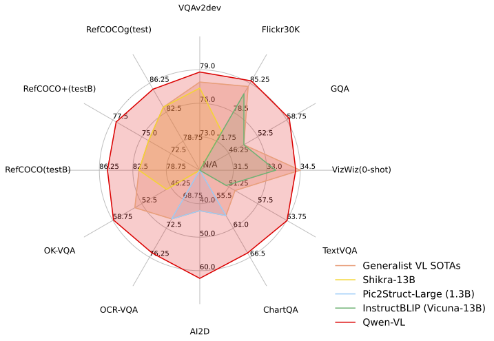
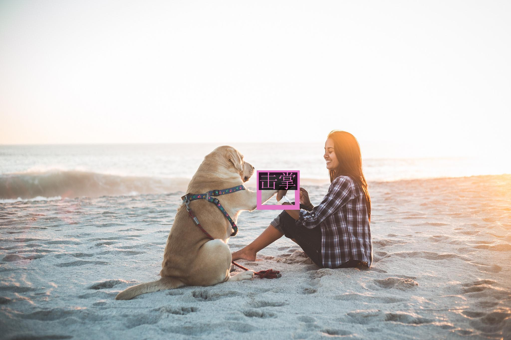

---
studios:
- qwen/Qwen-VL-Chat-Demo
tags:
- Qwen
- multimodal
- OCR
- 目标检测
- 图片问答
---

<br>

<p align="center">
    
<p>
<br>

<p align="center">
        Qwen-VL <a href="https://modelscope.cn/models/qwen/Qwen-VL/summary">🤖 <a> | <a href="https://huggingface.co/Qwen/Qwen-VL">🤗</a>&nbsp ｜ Qwen-VL-Chat <a href="https://modelscope.cn/models/qwen/Qwen-VL-Chat/summary">🤖 <a>| <a href="https://huggingface.co/Qwen/Qwen-VL-Chat">🤗</a>&nbsp ｜ &nbsp<a href="https://modelscope.cn/studios/qwen/Qwen-VL-Chat-Demo/summary">Demo</a>&nbsp ｜ &nbsp<a>Report</a>&nbsp&nbsp | &nbsp&nbsp<a href="https://discord.gg/z3GAxXZ9Ce">Discord</a>
</p>
<br>

**Qwen-VL** 是阿里云研发的大规模视觉语言模型（Large Vision Language Model, LVLM）。Qwen-VL 可以以图像、文本、检测框作为输入，并以文本和检测框作为输出。Qwen-VL 系列模型的特点包括：
- **强大的性能**：在四大类多模态任务的标准英文测评中（Zero-shot Caption/VQA/DocVQA/Grounding）上，均取得同等通用模型大小下最好效果；
- **多语言对话模型**：天然支持多语言对话，端到端支持图片里中英双语的长文本识别；
- **多图交错对话**：支持多图输入和比较，指定图片问答，多图文学创作等；
- **首个支持中文开放域定位的通用模型**：通过中文开放域语言表达进行检测框标注；
- **细粒度识别和理解**：相比于目前其它开源LVLM使用的224分辨率，Qwen-VL是首个开源的448分辨率的LVLM模型。更高分辨率可以提升细粒度的文字识别、文档问答和检测框标注。

**Qwen-VL** (Qwen Large Vision Language Model) is the visual multimodal version of the large model series, Qwen (abbr. Tongyi Qianwen), proposed by Alibaba Cloud. Qwen-VL accepts image, text, and bounding box as inputs, outputs text and bounding box. The features of Qwen-VL include:
- **Strong performance**: It significantly surpasses existing open-source Large Vision Language Models (LVLM) under similar scale settings on multiple English evaluation benchmarks (including Zero-shot caption, VQA, DocVQA, and Grounding).
- **Multi-lingual LVLM support text recognization**: Qwen-VL naturally supports multi-lingual conversation, and it promotes end-to-end recognition of Chinese and English bi-lingual text in images.
- **Multi-image interleaved conversations**: This feature allows for the input and comparison of multiple images, as well as the ability to specify questions related to the images and engage in multi-image storytelling.
- **First generalist model support grounding in Chinese**: Detecting bounding boxes through open-domain language expression in both Chinese and English.
- **Fine-grained recognization and understanding**: Compared to the 224 resolution currently used by other open-source LVLM, the 448 resolution promotes fine-grained text recognition, document QA, and bounding box annotation.

目前，我们提供了 Qwen-VL 系列的两个模型：
- Qwen-VL: Qwen-VL 以 Qwen-7B 的预训练模型作为语言模型的初始化，并以 [Openclip ViT-bigG](https://github.com/mlfoundations/open_clip) 作为视觉编码器的初始化，中间加入单层随机初始化的 cross-attention，经过约1.5B的图文数据训练得到。最终图像输入分辨率为448。
- Qwen-VL-Chat: 在 Qwen-VL 的基础上，我们使用对齐机制打造了基于大语言模型的视觉AI助手Qwen-VL-Chat，其训练数据涵盖了 QWen-7B 的纯文本 SFT 数据、开源 LVLM 的 SFT 数据、数据合成和人工标注的图文对齐数据。

如果想了解更多关于模型的信息，请点击[链接](visual_memo.md)查看我们的技术备忘录。

We release two models of the Qwen-VL series:
- Qwen-VL: The pre-trained LVLM model uses Qwen-7B as the initialization of the LLM, and [Openclip ViT-bigG](https://github.com/mlfoundations/open_clip) as the initialization of the visual encoder. And connects them with a randomly initialized cross-attention layer. Qwen-VL was trained on about 1.5B image-text paired data. The final image input resolution is 448.
- Qwen-VL-Chat: A multimodal LLM-based AI assistant, which is trained with alignment techniques.

For more details about Qwen-VL, please refer to our [technical memo](visual_memo.md).

<p align="center">
    
<p>

## 依赖项 (Dependency)

* python 3.8及以上版本
* pytorch 1.12及以上版本，推荐2.0及以上版本
* 建议使用CUDA 11.4及以上（GPU用户需考虑此选项）

```bash
pip install modelscope -U
pip install transformers accelerate tiktoken -U
pip install einops transformers_stream_generator -U
pip install "pillow==9.*" -U
pip install torchvision
pip install matplotlib -U
```
## 快速使用（Quickstart）

您可以通过以下代码轻松调用：

You can easily call the model with the following code:

```python
from modelscope import (
    snapshot_download, AutoModelForCausalLM, AutoTokenizer, GenerationConfig
)
import torch
model_id = 'qwen/Qwen-VL-Chat'
revision = 'v1.1.0'

model_dir = snapshot_download(model_id, revision=revision)
torch.manual_seed(1234)

# 请注意：分词器默认行为已更改为默认关闭特殊token攻击防护。
tokenizer = AutoTokenizer.from_pretrained(model_dir, trust_remote_code=True)
# 打开bf16精度，A100、H100、RTX3060、RTX3070等显卡建议启用以节省显存
# model = AutoModelForCausalLM.from_pretrained(model_dir, device_map="auto", trust_remote_code=True, bf16=True).eval()
# 打开fp16精度，V100、P100、T4等显卡建议启用以节省显存
model = AutoModelForCausalLM.from_pretrained(model_dir, device_map="auto", trust_remote_code=True, fp16=True).eval()
# 使用CPU进行推理，需要约32GB内存
# model = AutoModelForCausalLM.from_pretrained(model_dir, device_map="cpu", trust_remote_code=True).eval()
# 默认使用自动模式，根据设备自动选择精度
# model = AutoModelForCausalLM.from_pretrained(model_dir, device_map="auto", trust_remote_code=True).eval()

# 可指定不同的生成长度、top_p等相关超参
model.generation_config = GenerationConfig.from_pretrained(model_dir, trust_remote_code=True)

# 第一轮对话 1st dialogue turn
query = tokenizer.from_list_format([
    {'image': 'https://qianwen-res.oss-cn-beijing.aliyuncs.com/Qwen-VL/assets/demo.jpeg'},
    {'text': '这是什么'},
])
response, history = model.chat(tokenizer, query=query, history=None)
print(response)
# 图中是一名年轻女子在沙滩上和她的狗玩耍，狗的品种是拉布拉多。她们坐在沙滩上，狗的前腿抬起来，与人互动。

# 第二轮对话 2st dialogue turn
response, history = model.chat(tokenizer, '输出击掌的检测框', history=history)
print(response)
# <ref>"击掌"</ref><box>(211,412),(577,891)</box>
image = tokenizer.draw_bbox_on_latest_picture(response, history)
image.save('output_chat.jpg')
```

<p align="center">
    
<p>

使用量化

```python
import os
os.environ['CUDA_VISIBLE_DEVICES'] = '0'
from modelscope import (
    snapshot_download, AutoModelForCausalLM, AutoTokenizer, GenerationConfig,
)
from transformers import BitsAndBytesConfig
import torch
model_id = 'qwen/Qwen-VL-Chat'
revision = 'v1.1.0'

model_dir = snapshot_download(model_id, revision=revision)
torch.manual_seed(1234)
quantization_config = BitsAndBytesConfig(
    load_in_4bit=True,
    bnb_4bit_compute_dtype=torch.float16,
    bnb_4bit_quant_type='nf4',
    bnb_4bit_use_double_quant=True,
    llm_int8_skip_modules=['lm_head', 'attn_pool.attn'])

tokenizer = AutoTokenizer.from_pretrained(model_dir, trust_remote_code=True)
model = AutoModelForCausalLM.from_pretrained(model_dir, device_map="auto", 
                                             trust_remote_code=True, fp16=True,
                                             quantization_config=quantization_config).eval()
model.generation_config = GenerationConfig.from_pretrained(model_dir, trust_remote_code=True)

query = tokenizer.from_list_format([
    {'image': 'https://qianwen-res.oss-cn-beijing.aliyuncs.com/Qwen-VL/assets/demo.jpeg'},
    {'text': '这是什么'},
])
response, history = model.chat(tokenizer, query=query, history=None)
print(response)

response, history = model.chat(tokenizer, '输出狗的检测框', history=history)
print(response)
image = tokenizer.draw_bbox_on_latest_picture(response, history)
image.save('output_chat2.jpg')
```

## 微调(SFT)

**代码链接**: https://github.com/modelscope/swift/tree/main/examples/pytorch/llm

1. 支持的sft方法: lora, qlora, 全参数微调, ...
2. 支持的模型: qwen系列, qwen-vl系列, baichuan系列, chatglm2系列, llama系列, openbuddy-llama系列, internlm系列, xverse系列, ...
3. 支持的特性: 模型量化, DDP, 模型并行, gradient checkpointing, 梯度累加, 支持推送ModelScope Hub, 自定义数据集, 多模态和Agent SFT, 多轮对话, ...

使用qlora SFT qwen-vl-chat的脚本 (需要10GB显存)
```bash
# https://github.com/modelscope/swift/blob/main/examples/pytorch/llm/scripts/qwen_vl_chat/qlora/sft.sh
# Experimental environment: A10
# 10GB GPU memory (not use flash_attn)
PYTHONPATH=../../.. \
CUDA_VISIBLE_DEVICES=0 \
python llm_sft.py \
    --model_type qwen-vl-chat \
    --sft_type lora \
    --template_type chatml \
    --dtype bf16 \
    --output_dir output \
    --dataset coco-en \
    --train_dataset_sample 20000 \
    --num_train_epochs 1 \
    --max_length 2048 \
    --quantization_bit 4 \
    --bnb_4bit_comp_dtype bf16 \
    --lora_rank 8 \
    --lora_alpha 32 \
    --lora_dropout_p 0. \
    --lora_target_modules c_attn attn.c_proj \
    --gradient_checkpointing true \
    --batch_size 1 \
    --weight_decay 0. \
    --learning_rate 1e-4 \
    --gradient_accumulation_steps 16 \
    --max_grad_norm 0.5 \
    --warmup_ratio 0.03 \
    --eval_steps 100 \
    --save_steps 100 \
    --save_total_limit 2 \
    --logging_steps 10 \
    --use_flash_attn false \
    --push_to_hub false \
    --hub_model_id qwen-vl-chat-qlora \
    --hub_private_repo true \
    --hub_token 'your-sdk-token' \

```


## 评测

我们从两个角度评测了两个模型的能力：
1. 在**英文标准 Benchmark** 上评测模型的基础任务能力。目前评测了四大类多模态任务：
    - Zero-shot Caption: 评测模型在未见过数据集上的零样本图片描述能力；
    - General VQA: 评测模型的通用问答能力，例如判断题、颜色、个数、类目等问答能力；
    - Text-based VQA：评测模型对于图片中文字相关的识别/问答能力，例如文档问答、图表问答、文字问答等；
    - Referring Expression Compression：评测模型给定物体描述画检测框的能力；

2. **试金石 (TouchStone)**：为了评测模型整体的图文对话能力和人类对齐水平。我们为此构建了一个基于 GPT4 打分来评测 LVLM 模型的 Benchmark：TouchStone。在 TouchStone-v0.1 中：
    - 评测基准总计涵盖 300+张图片、800+道题目、27个类别。包括基础属性问答、人物地标问答、影视作品问答、视觉推理、反事实推理、诗歌创作、故事写作，商品比较、图片解题等**尽可能广泛的类别**。
    - 为了弥补目前 GPT4 无法直接读取图片的缺陷，我们给所有的带评测图片提供了**人工标注的充分详细描述**，并且将图片的详细描述、问题和模型的输出结果一起交给 GPT4 打分。
    - 评测同时包含英文版本和中文版本。
  
评测结果如下：

We evaluated the model's ability from two perspectives:
1. **Standard Benchmarks**: We evaluate the model's basic task capabilities on four major categories of multimodal tasks:
   - Zero-shot Caption: Evaluate model's zero-shot image captioning ability on unseen datasets;
   - General VQA: Evaluate the general question-answering ability of pictures, such as the judgment, color, number, category, etc;
   - Text-based VQA: Evaluate the model's ability to recognize text in pictures, such as document QA, chart QA, etc;
   - Referring Expression Comprehension: Evaluate the ability to localize a target object in an image described by a referring expression.

2. **TouchStone**: To evaluate the overall text-image dialogue capability and alignment level with humans, we have constructed a benchmark called TouchStone, which is based on scoring with GPT4 to evaluate the LVLM model.
   - The TouchStone benchmark covers a total of 300+ images, 800+ questions, and 27 categories. Such as attribute-based Q&A, celebrity recognition, writing poetry, summarizing multiple images, product comparison, math problem solving, etc;
   - In order to break the current limitation of GPT4 in terms of direct image input, TouchStone provides fine-grained image annotations by human labeling. These detailed annotations, along with the questions and the model's output, are then presented to GPT4 for scoring.
   - The benchmark includes both English and Chinese versions.

### Zero-shot Captioning & General VQA
<table>
<thead>
  <tr>
    <th rowspan="2">Model type</th>
    <th rowspan="2">Model</th>
    <th colspan="2">Zero-shot Captioning</th>
    <th colspan="5">General VQA</th>
  </tr>
  <tr>
    <th>NoCaps</th>
    <th>Flickr30K</th>
    <th>VQAv2<sup>dev</sup></th>
    <th>OK-VQA</th>
    <th>GQA</th>
    <th>SciQA-Img<br>(0-shot)</th>
    <th>VizWiz<br>(0-shot)</th>
  </tr>
</thead>
<tbody align="center">
  <tr>
    <td rowspan="10">Generalist<br>Models</td>
    <td>Flamingo-9B</td>
    <td>-</td>
    <td>61.5</td>
    <td>51.8</td>
    <td>44.7</td>
    <td>-</td>
    <td>-</td>
    <td>28.8</td>
  </tr>
  <tr>
    <td>Flamingo-80B</td>
    <td>-</td>
    <td>67.2</td>
    <td>56.3</td>
    <td>50.6</td>
    <td>-</td>
    <td>-</td>
    <td>31.6</td>
  </tr>
  <tr>
    <td>Unified-IO-XL</td>
    <td>100.0</td>
    <td>-</td>
    <td>77.9</td>
    <td>54.0</td>
    <td>-</td>
    <td>-</td>
    <td>-</td>
  </tr>
  <tr>
    <td>Kosmos-1</td>
    <td>-</td>
    <td>67.1</td>
    <td>51.0</td>
    <td>-</td>
    <td>-</td>
    <td>-</td>
    <td>29.2</td>
  </tr>
  <tr>
    <td>Kosmos-2</td>
    <td>-</td>
    <td>66.7</td>
    <td>45.6</td>
    <td>-</td>
    <td>-</td>
    <td>-</td>
    <td>-</td>
  </tr>
  <tr>
    <td>BLIP-2 (Vicuna-13B)</td>
    <td>103.9</td>
    <td>71.6</td>
    <td>65.0</td>
    <td>45.9</td>
    <td>32.3</td>
    <td>61.0</td>
    <td>19.6</td>
  </tr>
  <tr>
    <td>InstructBLIP (Vicuna-13B)</td>
    <td><strong>121.9</strong></td>
    <td>82.8</td>
    <td>-</td>
    <td>-</td>
    <td>49.5</td>
    <td>63.1</td>
    <td>33.4</td>
  </tr>
  <tr>
    <td>Shikra (Vicuna-13B)</td>
    <td>-</td>
    <td>73.9</td>
    <td>77.36</td>
    <td>47.16</td>
    <td>-</td>
    <td>-</td>
    <td>-</td>
  </tr>
  <tr>
    <td><strong>Qwen-VL (Qwen-7B)</strong></td>
    <td>121.4</td>
    <td><b>85.8</b></td>
    <td><b>78.8</b></td>
    <td><b>58.6</b></td>
    <td><b>59.3</b></td>
    <td>67.1</td>
    <td>35.2</td>
  </tr>
  <!-- <tr>
    <td>Qwen-VL (4-shot)</td>
    <td>-</td>
    <td>-</td>
    <td>-</td>
    <td>63.6</td>
    <td>-</td>
    <td>-</td>
    <td>39.1</td>
  </tr> -->
  <tr>
    <td>Qwen-VL-Chat</td>
    <td>120.2</td>
    <td>81.0</td>
    <td>78.2</td>
    <td>56.6</td>
    <td>57.5</td>
    <td><b>68.2</b></td>
    <td><b>38.9</b></td>
  </tr>
  <!-- <tr>
    <td>Qwen-VL-Chat (4-shot)</td>
    <td>-</td>
    <td>-</td>
    <td>-</td>
    <td>60.6</td>
    <td>-</td>
    <td>-</td>
    <td>44.45</td>
  </tr> -->
  <tr>
    <td>Previous SOTA<br>(Per Task Fine-tuning)</td>
    <td>-</td>
    <td>127.0<br>(PALI-17B)</td>
    <td>84.5<br>(InstructBLIP<br>-FlanT5-XL)</td>
    <td>86.1<br>(PALI-X<br>-55B)</td>
    <td>66.1<br>(PALI-X<br>-55B)</td>
    <td>72.1<br>(CFR)</td>
    <td>92.53<br>(LLaVa+<br>GPT-4)</td>
    <td>70.9<br>(PALI-X<br>-55B)</td>
  </tr>
</tbody>
</table>

- 在 Zero-shot Caption 中，Qwen-VL 在 Flickr30K 数据集上取得了 **SOTA** 的结果，并在 Nocaps 数据集上取得了和 InstructBlip 可竞争的结果。
- 在 General VQA 中，Qwen-VL 取得了 LVLM 模型同等量级和设定下 **SOTA** 的结果。

- For zero-shot image captioning, Qwen-VL achieves the **SOTA** on Flickr30K and competitive results on Nocaps with InstructBlip.
- For general VQA, Qwen-VL achieves the **SOTA** under the same generalist LVLM scale settings.

### Text-oriented VQA (focuse on text understanding capabilities in images)

<table>
<thead>
  <tr>
    <th>Model type</th>
    <th>Model</th>
    <th>TextVQA</th>
    <th>DocVQA</th>
    <th>ChartQA</th>
    <th>AI2D</th>
    <th>OCR-VQA</th>
  </tr>
</thead>
<tbody align="center">
  <tr>
    <td rowspan="5">Generalist Models</td>
    <td>BLIP-2 (Vicuna-13B)</td>
    <td>42.4</td>
    <td>-</td>
    <td>-</td>
    <td>-</td>
    <td>-</td>
  </tr>
  <tr>
    <td>InstructBLIP (Vicuna-13B)</td>
    <td>50.7</td>
    <td>-</td>
    <td>-</td>
    <td>-</td>
    <td>-</td>
  </tr>
  <tr>
    <td>mPLUG-DocOwl (LLaMA-7B)</td>
    <td>52.6</td>
    <td>62.2</td>
    <td>57.4</td>
    <td>-</td>
    <td>-</td>
  </tr>
  <tr>
    <td>Pic2Struct-Large (1.3B)</td>
    <td>-</td>
    <td><b>76.6</b></td>
    <td>58.6</td>
    <td>42.1</td>
    <td>71.3</td>
  </tr>
  <tr>
    <td>Qwen-VL (Qwen-7B)</td>
    <td><b>63.8</b></td>
    <td>65.1</td>
    <td><b>65.7</b></td>
    <td><b>62.3</b></td>
    <td><b>75.7</b></td>
  </tr>
  <tr>
    <td>Specialist SOTAs<br>(Specialist/Finetuned)</td>
    <td>PALI-X-55B (Single-task FT)<br>(Without OCR Pipeline)</td>
    <td>71.44</td>
    <td>80.0</td>
    <td>70.0</td>
    <td>81.2</td>
    <td>75.0</td>
  </tr>
</tbody>
</table>

- 在文字相关的识别/问答评测上，取得了当前规模下通用 LVLM 达到的最好结果。
- 分辨率对上述某几个评测非常重要，大部分 224 分辨率的开源 LVLM 模型无法完成以上评测，或只能通过切图的方式解决。Qwen-VL 将分辨率提升到 448，可以直接以端到端的方式进行以上评测。Qwen-VL 在很多任务上甚至超过了 1024 分辨率的 Pic2Struct-Large 模型。

- In text-related recognition/QA evaluation, Qwen-VL achieves the SOTA under the generalist LVLM scale settings.
- Resolution is important for several above evaluations. While most open-source LVLM models with 224 resolution are incapable of these evaluations or can only solve these by cutting images, Qwen-VL scales the resolution to 448 so that it can be evaluated end-to-end. Qwen-VL even outperforms Pic2Struct-Large models of 1024 resolution on some tasks.

### Referring Expression Comprehension
<table>
<thead>
  <tr>
    <th rowspan="2">Model type</th>
    <th rowspan="2">Model</th>
    <th colspan="3">RefCOCO</th>
    <th colspan="3">RefCOCO+</th>
    <th colspan="2">RefCOCOg</th>
    <th>GRIT</th>
  </tr>
  <tr>
    <th>val</th>
    <th>test-A</th>
    <th>test-B</th>
    <th>val</th>
    <th>test-A</th>
    <th>test-B</th>
    <th>val-u</th>
    <th>test-u</th>
    <th>refexp</th>
  </tr>
</thead>
<tbody align="center">
  <tr>
    <td rowspan="8">Generalist Models</td>
    <td>GPV-2</td>
    <td>-</td>
    <td>-</td>
    <td>-</td>
    <td>-</td>
    <td>-</td>
    <td>-</td>
    <td>-</td>
    <td>-</td>
    <td>51.50</td>
  </tr>
  <tr>
    <td>OFA-L*</td>
    <td>79.96</td>
    <td>83.67</td>
    <td>76.39</td>
    <td>68.29</td>
    <td>76.00</td>
    <td>61.75</td>
    <td>67.57</td>
    <td>67.58</td>
    <td>61.70</td>
  </tr>
  <tr>
    <td>Unified-IO</td>
    <td>-</td>
    <td>-</td>
    <td>-</td>
    <td>-</td>
    <td>-</td>
    <td>-</td>
    <td>-</td>
    <td>-</td>
    <td><b>78.61</b></td>
  </tr>
  <tr>
    <td>VisionLLM-H</td>
    <td></td>
    <td>86.70</td>
    <td>-</td>
    <td>-</td>
    <td>-</td>
    <td>-</td>
    <td>-</td>
    <td>-</td>
    <td>-</td>
  </tr>
  <tr>
    <td>Shikra-7B</td>
    <td>87.01</td>
    <td>90.61</td>
    <td>80.24 </td>
    <td>81.60</td>
    <td>87.36</td>
    <td>72.12</td>
    <td>82.27</td>
    <td>82.19</td>
    <td>69.34</td>
  </tr>
  <tr>
    <td>Shikra-13B</td>
    <td>87.83 </td>
    <td>91.11</td>
    <td>81.81</td>
    <td>82.89</td>
    <td>87.79</td>
    <td>74.41</td>
    <td>82.64</td>
    <td>83.16</td>
    <td>69.03</td>
  </tr>
  <tr>
    <td>Qwen-VL-7B</td>
    <td><b>89.36</b></td>
    <td>92.26</td>
    <td><b>85.34</b></td>
    <td><b>83.12</b></td>
    <td>88.25</td>
    <td><b>77.21</b></td>
    <td>85.58</td>
    <td>85.48</td>
    <td>78.22</td>
  </tr>
  <tr>
    <td>Qwen-VL-7B-Chat</td>
    <td>88.55</td>
    <td><b>92.27</b></td>
    <td>84.51</td>
    <td>82.82</td>
    <td><b>88.59</b></td>
    <td>76.79</td>
    <td><b>85.96</b></td>
    <td><b>86.32</b></td>
    <td>-</td>
  <tr>
    <td rowspan="3">Specialist SOTAs<br>(Specialist/Finetuned)</td>
    <td>G-DINO-L</td>
    <td>90.56&nbsp;&nbsp;</td>
    <td>93.19</td>
    <td>88.24</td>
    <td>82.75</td>
    <td>88.95</td>
    <td>75.92</td>
    <td>86.13</td>
    <td>87.02</td>
    <td>-</td>
  </tr>
  <tr>
    <td>UNINEXT-H</td>
    <td>92.64 </td>
    <td>94.33</td>
    <td>91.46</td>
    <td>85.24</td>
    <td>89.63</td>
    <td>79.79</td>
    <td>88.73</td>
    <td>89.37</td>
    <td>-</td>
  </tr>
  <tr>
    <td>ONE-PEACE</td>
    <td>92.58 </td>
    <td>94.18</td>
    <td>89.26</td>
    <td>88.77</td>
    <td>92.21</td>
    <td>83.23</td>
    <td>89.22</td>
    <td>89.27</td>
    <td>-</td>
  </tr>
</tbody>
</table>

- 在定位任务上，Qwen-VL 全面超过 Shikra-13B，取得了目前 Generalist LVLM 模型上在 Refcoco 上的 **SOTA**。
- Qwen-VL 并没有在任何中文定位数据上训练过，但通过中文 Caption 数据和 英文 Grounding 数据的训练，可以 Zero-shot 泛化出中文 Grounding 能力。

- Qwen-VL achieves the **SOTA** in all above referring expression comprehension benchmarks.
- Qwen-VL has not been trained on any Chinese grounding data, but it can still generalize to the Chinese Grounding tasks in a zero-shot way by training Chinese Caption data and English Grounding data.

我们提供了以上**所有**评测脚本以供复现我们的实验结果。请阅读 [eval/EVALUATION.md](eval/EVALUATION.md) 了解更多信息。

We provide all of the above evaluation scripts for reproducing our experimental results. Please read [eval/EVALUATION.md](eval/EVALUATION.md) for more information.

### Chat 能力测评

TouchStone 是一个基于 GPT4 打分来评测 LVLM 模型的图文对话能力和人类对齐水平的基准。它涵盖了 300+张图片、800+道题目、27个类别，包括基础属性、人物地标、视觉推理、诗歌创作、故事写作、商品比较、图片解题等**尽可能广泛的类别**。关于 TouchStone 的详细介绍，请参考这里(TODO: Link)。

TouchStone is a benchmark based on scoring with GPT4 to evaluate the abilities of the LVLM model on text-image dialogue and alignment levels with humans. It covers a total of 300+ images, 800+ questions, and 27 categories, such as attribute-based Q&A, celebrity recognition, writing poetry, summarizing multiple images, product comparison, math problem solving, etc. Please read [eval/EVALUATION.md](eval/EVALUATION.md) for more information.

#### 英文版本测评

| Model         | Score |
|---------------|-------|
| PandaGPT      | 488.5 |
| MiniGPT4      | 531.7 |
| InstructBLIP  | 552.4 |
| LLaMA-AdapterV2 | 590.1 |
| mPLUG-Owl     | 605.4 |
| LLaVA         | 602.7 |
| Qwen-VL-Chat   | 645.2 |

#### 中文版本测评

| Model         | Score |
|---------------|-------|
| VisualGLM     | 247.1 |
| Qwen-VL-Chat   | 401.2 |

Qwen-VL-Chat 模型在中英文的对齐评测中均取得当前 LVLM 模型下的最好结果。

The Qwen-VL-Chat model has achieved the best results in both Chinese and English alignment evaluation.


## FAQ

如遇到问题，敬请查阅[FAQ](FAQ_zh.md)以及issue区，如仍无法解决再提交issue。


## 使用协议

研究人员与开发者可使用Qwen-VL和Qwen-VL-Chat或进行二次开发。我们同样允许商业使用，具体细节请查看[LICENSE](LICENSE)。如需商用，请填写[问卷](https://dashscope.console.aliyun.com/openModelApply/qianwen)申请。

## 联系我们

如果你想给我们的研发团队和产品团队留言，请通过邮件（qianwen_opensource@alibabacloud.com）联系我们。

